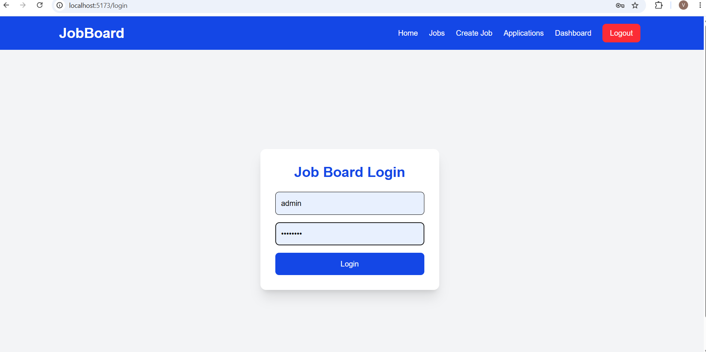
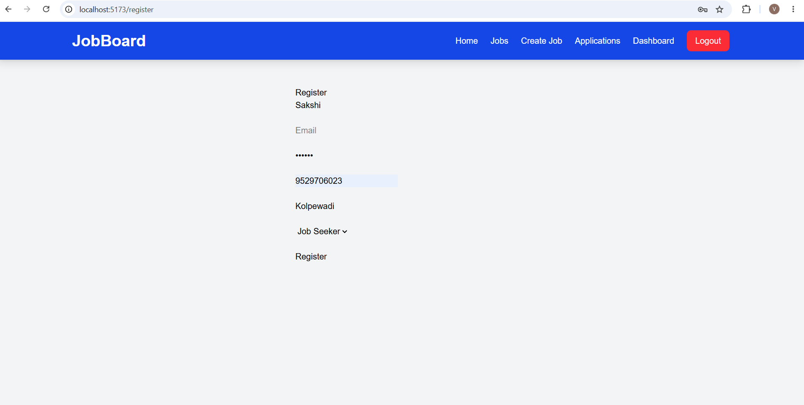
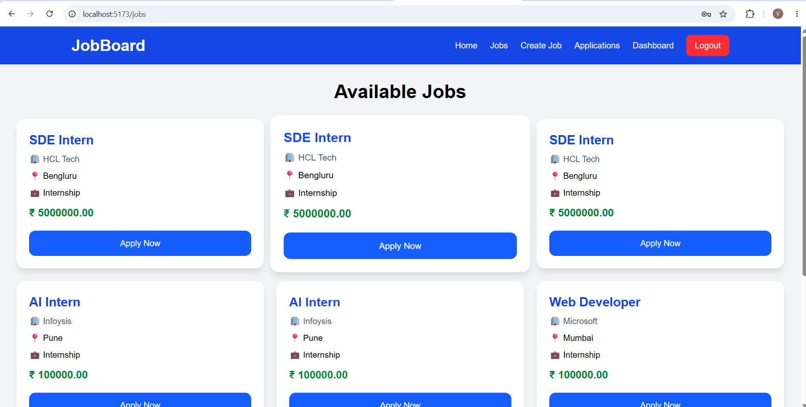
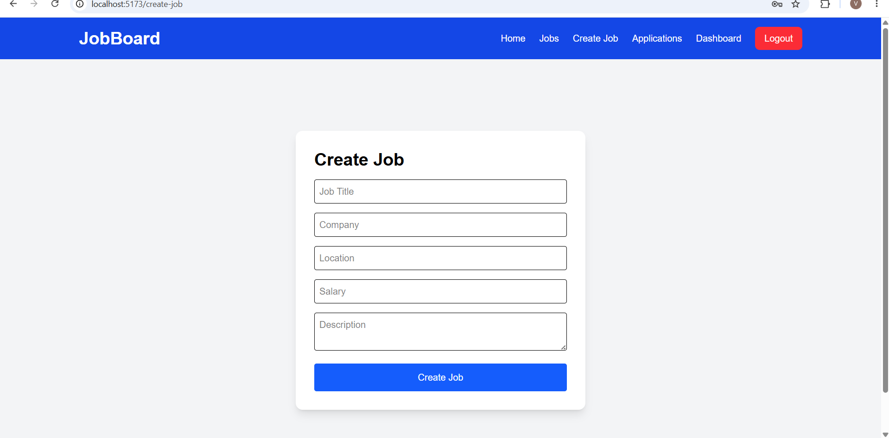
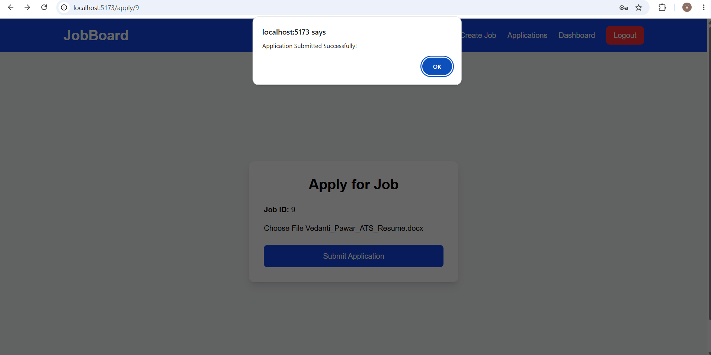
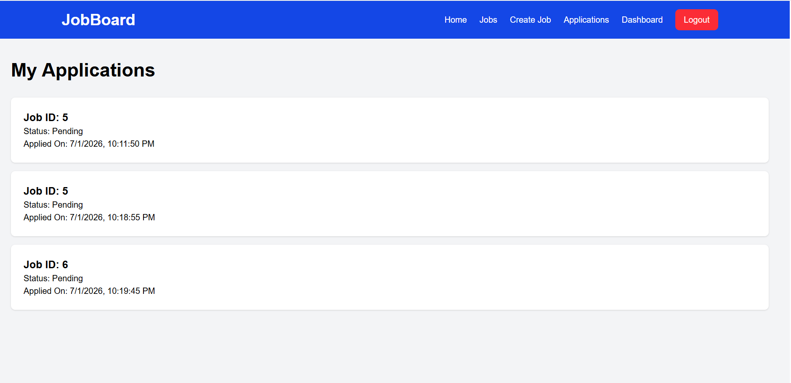
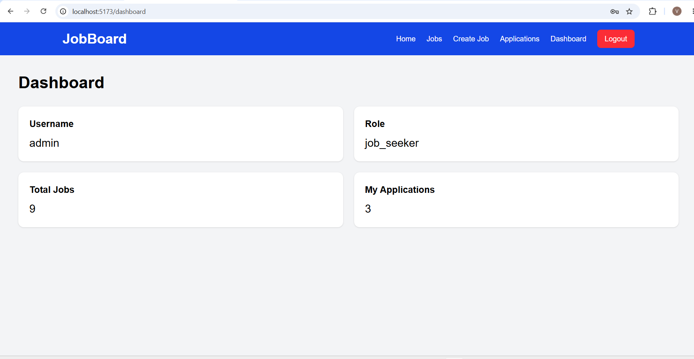

# 🚀 JobBoard Platform

A Full Stack Job Board Platform built using **React**, **Django REST Framework**, **PostgreSQL**, **JWT Authentication**, and **Tailwind CSS**. The platform allows employers to post jobs and job seekers to browse and apply for jobs with resume uploads.

---

# ✨ Features

- 👤 User Registration
- 🔐 JWT Authentication (Login)
- 📋 Dashboard
- 💼 Create Job
- 🔍 View Available Jobs
- 📄 Apply for Jobs
- 📎 Resume Upload
- 📑 My Applications
- 🗄 PostgreSQL Database
- 🌐 REST API

---

# 🛠 Tech Stack

## Frontend

- React
- Vite
- Tailwind CSS
- Axios
- React Router DOM

## Backend

- Django
- Django REST Framework
- Simple JWT

## Database

- PostgreSQL

---

# 📁 Project Structure

```text
JobBoardPlatform/
│
├── backend/
│   ├── applications/
│   ├── jobs/
│   ├── users/
│   ├── jobboard/
│   ├── media/
│   ├── manage.py
│   └── .env.example
│
├── frontend/
│   ├── src/
│   ├── public/
│   ├── package.json
│   └── vite.config.js
│
├── screenshots/
│
├── README.md
└── .gitignore
```

---

# 🚀 Installation

## 1️⃣ Clone Repository

```bash
git clone https://github.com/Vedanti190307/JobBoardPlatform.git

cd JobBoardPlatform
```

---

## 2️⃣ Backend Setup

```bash
cd backend

python -m venv venv

venv\Scripts\activate

pip install -r requirements.txt

python manage.py migrate

python manage.py runserver
```

Backend runs on:

```
http://127.0.0.1:8000
```

---

## 3️⃣ Frontend Setup

```bash
cd frontend

npm install

npm run dev
```

Frontend runs on:

```
http://localhost:5173
```

---

# 📸 Screenshots

## 🏠 Home


---

## 🔑 Login



---

## 📝 Register



---

## 💼 Jobs



---

## ➕ Create Job



---

## 📄 Apply Job



---

## 📋 My Applications



---

## 📊 Dashboard



---

# 📌 REST API Endpoints

| Method | Endpoint | Description |
|---------|----------|-------------|
| POST | `/api/users/register/` | Register User |
| POST | `/api/login/` | Login |
| GET | `/api/jobs/` | View Jobs |
| POST | `/api/jobs/` | Create Job |
| POST | `/api/applications/` | Apply for Job |
| GET | `/api/users/dashboard/` | Dashboard |
| GET | `/api/applications/` | My Applications |

---

# 👩‍💻 Author

**Vedanti Pawar**

- GitHub: https://github.com/Vedanti190307

---

# ⭐ If you like this project

Please consider giving it a ⭐ on GitHub.
